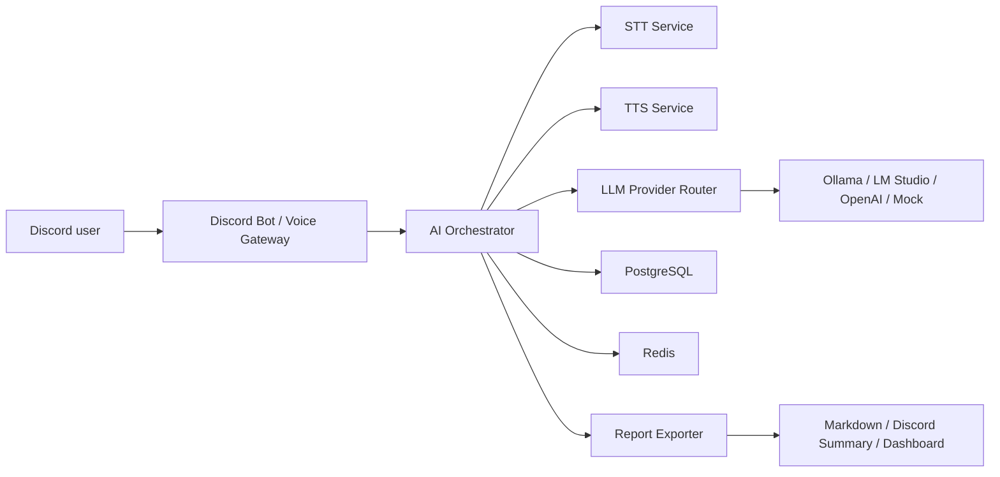
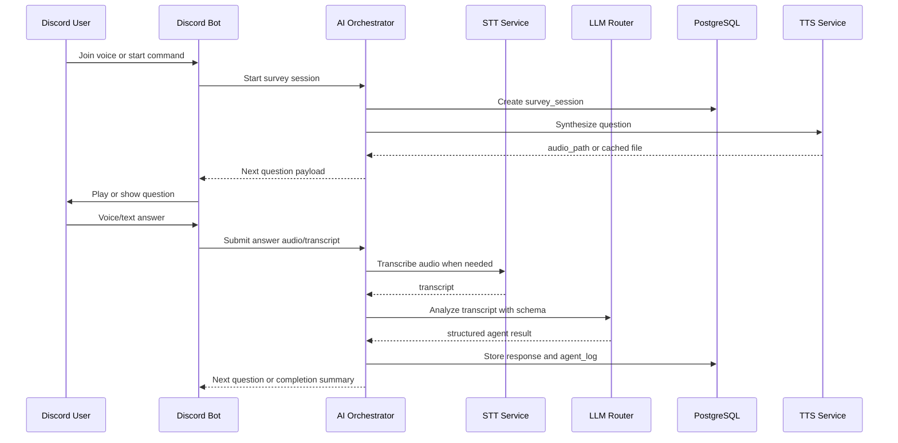

# Architecture

## 전체 아키텍처

시스템은 Discord gateway, AI Orchestrator, STT service, TTS service, PostgreSQL, Redis, dashboard/report exporter로 구성된다. 각 provider는 router와 interface 뒤에 배치해 `.env` 변경으로 교체 가능하게 한다.

## 서비스별 책임

- `discord-bot`: Discord text/voice gateway, 질문 재생, 응답 수집, Orchestrator 호출
- `ai-orchestrator`: 설문 상태 머신, provider router, agent runner, repository 호출, 통계/보고 API
- `stt-service`: audio file 또는 mock input을 transcript로 변환
- `tts-service`: 질문 텍스트를 wav/cache file로 변환
- `postgres`: 세션, 응답, audio record, stats snapshot, agent log 저장
- `redis`: 세션 lock, short-lived state, queue/cache 후보
- `dashboard`: 통계 조회와 수동 운영 화면 후보

## 데이터 흐름

1. Discord gateway가 설문 시작 요청을 Orchestrator에 보낸다.
2. Orchestrator가 survey definition을 로드하고 session을 생성한다.
3. Orchestrator가 다음 질문과 TTS 요청 정보를 반환한다.
4. Discord gateway가 질문 음성을 재생하거나 텍스트로 출력한다.
5. 응답 audio 또는 transcript가 Orchestrator로 들어온다.
6. 필요 시 Orchestrator가 STT service에 transcript 생성을 요청한다.
7. Agent runner가 LLM/mock provider로 응답을 structured JSON으로 분석한다.
8. Repository가 PostgreSQL에 결과를 저장한다.
9. 상태 머신이 다음 질문 또는 종료를 반환한다.
10. 종료 시 stats/report exporter가 요약을 생성한다.

## Provider Router 구조

Provider router는 interface와 implementation을 분리한다.

- `LLMProvider`: `mock`, `ollama`, `lmstudio`, `openai`
- `STTProvider`: `mock`, `local_whisper`, `openai`, `deepgram`
- `TTSProvider`: `mock`, `cached_file`, `local_piper`, `openai`
- `DiscordVoiceGateway`: `mock`, `discord.py`, `voice-recv`
- `StorageRepository`: `postgres`, `memory`
- `ReportExporter`: `markdown`, `json`, `dashboard`
- `SurveyDefinitionLoader`: `yaml`, `database`
- `AgentRunner`: `mock`, `llm_json_schema`

Provider selection은 `.env`의 `*_PROVIDER` 값으로 결정한다. 미설정 또는 설정 실패 시 Phase 초기에는 mock/skip/fallback으로 graceful degradation한다.

## Phase 2 Agent Runner

Phase 2부터 Orchestrator는 mock LLM을 직접 호출하지 않고 `AnswerAnalyzer -> LLMRouter -> LLMProvider` 순서로 응답을 분석한다. Provider 응답은 `AgentResult` Pydantic 모델로 검증되며, parse/schema 실패 시 retry 후 fallback provider를 사용한다.
